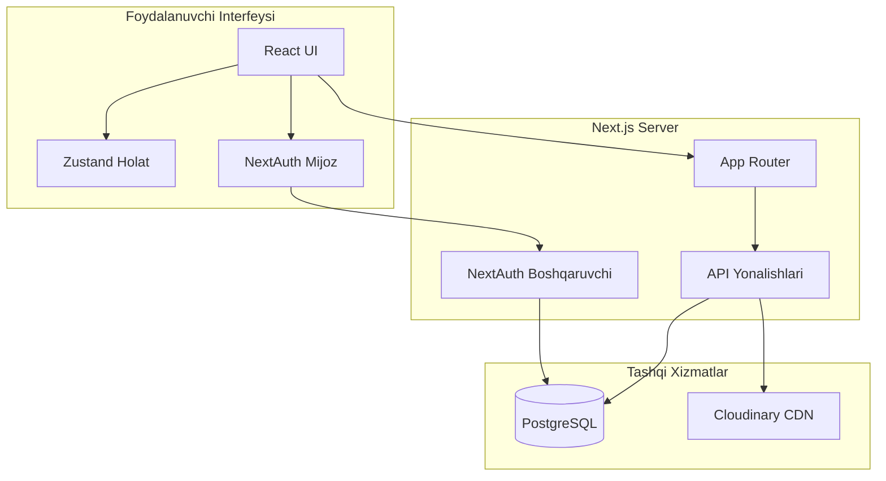
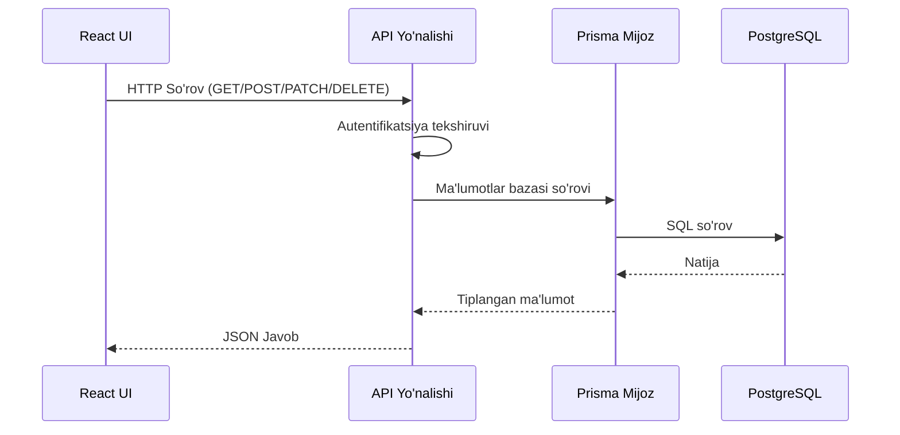

# Loyiha Arxitekturasi

**NAVQURT Boshqaruv Paneli** - Next.js App Router asosidagi to'liq web ilova.

---

## 🏗 Arxitektura Diagrammasi



---

## 📂 Papka Tuzilmasi

```
web/src/
├── app/                          # Next.js App Router
│   ├── api/                      # API Yo'nalishlari
│   │   ├── admin/                # Administrator API'lari
│   │   │   ├── categories/       # Kategoriyalar CRUD
│   │   │   ├── customers/        # Mijozlar ro'yxati
│   │   │   ├── orders/           # Buyurtmalar boshqaruvi
│   │   │   ├── products/         # Mahsulotlar CRUD
│   │   │   ├── settings/         # Sozlamalar
│   │   │   ├── upload/           # Rasm yuklash (Cloudinary)
│   │   │   └── warehouse/        # Omborxona CRUD
│   │   ├── auth/                 # NextAuth boshqaruvchi
│   │   ├── health/               # Sog'liq tekshiruvi
│   │   └── seed/                 # Ma'lumotlar bazasi boshlang'ich
│   ├── dashboard/                # Boshqaruv paneli sahifalari
│   │   ├── categories/           # Kategoriyalar sahifasi
│   │   ├── customers/            # Mijozlar sahifasi
│   │   ├── orders/               # Buyurtmalar sahifasi
│   │   ├── products/             # Mahsulotlar sahifasi
│   │   ├── settings/             # Sozlamalar sahifasi
│   │   ├── warehouse/            # Omborxona sahifasi
│   │   ├── layout.tsx            # Boshqaruv paneli tartibi
│   │   └── page.tsx              # Boshqaruv paneli bosh sahifa
│   ├── login/                    # Kirish sahifasi
│   ├── globals.css               # Global CSS
│   ├── layout.tsx                # Asosiy tartib
│   ├── page.tsx                  # Bosh sahifa (kirish sahifasiga yo'naltirish)
│   └── providers.tsx             # Kontekst provayderlar
├── components/                   # React komponentlar
│   ├── ui/                       # Shadcn/UI komponentlari
│   │   ├── avatar.tsx
│   │   ├── button.tsx
│   │   ├── dialog.tsx
│   │   ├── dropdown-menu.tsx
│   │   ├── input.tsx
│   │   ├── label.tsx
│   │   ├── separator.tsx
│   │   ├── sheet.tsx
│   │   └── textarea.tsx
│   ├── sidebar.tsx               # Yon panel komponenti
│   └── splash-screen.tsx         # Yuklash ekrani
├── lib/                          # Yordamchi va sozlamalar
│   ├── api-auth.ts               # API autentifikatsiya
│   ├── api-client.ts             # Tiplangan API mijoz
│   ├── api-response.ts           # API javob yordamchilari
│   ├── auth.ts                   # Autentifikatsiya yordamchilari
│   ├── cloudinary.ts             # Cloudinary sozlamasi
│   ├── config.ts                 # Ilova sozlamasi
│   ├── constants.ts              # Doimiylar
│   ├── date-utils.ts             # Sana formatlash
│   ├── logger.ts                 # Log yozish yordamchisi
│   ├── prisma.ts                 # Prisma mijoz
│   ├── store.ts                  # Zustand holat
│   ├── types.ts                  # Umumiy tiplar
│   ├── utils.ts                  # Yordamchi funksiyalar
│   └── validation.ts             # Tekshiruv funksiyalari
└── types/                        # TypeScript tiplari
    └── index.ts
```

---

## 🔄 Ma'lumot Oqimi



---

## 🔐 Autentifikatsiya

**NextAuth.js** Credentials provayderi ishlatiladi:

1. Foydalanuvchi kirish sahifasida elektron pochta/parol kiritadi
2. NextAuth credentials provayderga so'rov yuboriladi
3. AdminUser jadvalidan tekshiriladi (bcrypt xeshlash)
4. JWT token yaratiladi va cookie'ga saqlanadi
5. API'lar `getServerSession()` orqali tekshiriladi

---

## 📦 Holat Boshqaruvi

**Zustand** quyidagi ma'lumotlar uchun ishlatiladi:
- `theme`: qorong'i/yorug' mavzu holati
- `toggleTheme()`: mavzuni almashtirish

Sahifalar o'zining mahalliy holatini ishlatadi (React useState/useEffect).

---

## 🎨 Dizayn

- **Tailwind CSS 4.x** - yordamchi sinflar asosida CSS
- **Glassmorphism** dizayn - shaffof kartalar, xiralik effektlari
- **Qorong'i rejim** - asosiy mavzu qorong'i
- **Moslashuvchan** - mobil, planshet, kompyuter

---

## 📡 API Arxitekturasi

Barcha API'lar `/api/admin/` prefiksi ostida:

| Modul | Yo'nalish | Metodlar |
|-------|-----------|----------|
| Mahsulotlar | `/api/admin/products` | GET, POST |
| Mahsulotlar | `/api/admin/products/[id]` | PATCH, DELETE |
| Kategoriyalar | `/api/admin/categories` | GET, POST |
| Kategoriyalar | `/api/admin/categories/[id]` | PATCH, DELETE |
| Buyurtmalar | `/api/admin/orders` | GET |
| Buyurtmalar | `/api/admin/orders/[id]` | PATCH |
| Ombor Mahsulotlari | `/api/admin/warehouse/items` | GET, POST |
| Ombor Mahsulotlari | `/api/admin/warehouse/items/[id]` | PATCH, DELETE |
| Ombor Harakatlari | `/api/admin/warehouse/movements` | GET, POST |
| Sozlamalar | `/api/admin/settings` | GET, PATCH |
| Yuklash | `/api/admin/upload` | POST |
| Yuklash O'chirish | `/api/admin/upload/delete` | POST |
| Mijozlar | `/api/admin/customers` | GET |

---

*Oxirgi yangilanish: 2026-yil 9-yanvar*
