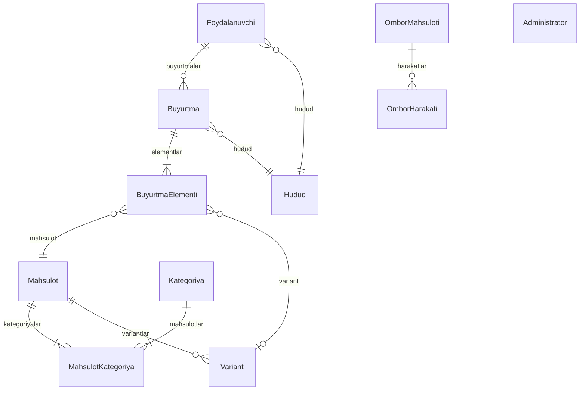

# Ma'lumotlar Bazasi Tuzilmasi

**ORM:** Prisma 5.22.0  
**Ma'lumotlar bazasi:** PostgreSQL  
**Sxema:** `web/prisma/schema.prisma`

---

## 📊 ER Diagramma



---

## 📋 Jadvallar

### 1. User (Foydalanuvchilar)

Telegram bot orqali ro'yxatdan o'tgan mijozlar.

| Ustun | Turi | Tavsif |
|-------|------|--------|
| id | UUID | Asosiy kalit |
| telegramId | BigInt | Telegram foydalanuvchi ID (yagona) |
| fullName | String? | To'liq ism |
| phone | String? | Telefon raqami |
| regionId | String? | Hudud ID |
| address | String? | Manzil |
| createdAt | DateTime | Yaratilgan sana |

---

### 2. AdminUser (Administratorlar)

Boshqaruv paneli foydalanuvchilari.

| Ustun | Turi | Tavsif |
|-------|------|--------|
| id | UUID | Asosiy kalit |
| email | String | Elektron pochta (yagona) |
| passwordHash | String | Bcrypt bilan xeshlangan parol |
| name | String? | Ism |
| role | String | Rol ("admin") |
| createdAt | DateTime | Yaratilgan sana |
| updatedAt | DateTime | Yangilangan sana |

---

### 3. Category (Kategoriyalar)

Mahsulot kategoriyalari.

| Ustun | Turi | Tavsif |
|-------|------|--------|
| id | UUID | Asosiy kalit |
| name | String | Kategoriya nomi (yagona) |
| color | String? | HEX rang kodi |
| createdAt | DateTime | Yaratilgan sana |

---

### 4. Product (Mahsulotlar)

Sotiladigan mahsulotlar.

| Ustun | Turi | Tavsif |
|-------|------|--------|
| id | UUID | Asosiy kalit |
| name | String | Mahsulot nomi |
| description | String? | Tavsif |
| image | String? | Rasm havolasi |
| imagePublicId | String? | Cloudinary ommaviy ID |
| price | Int | Narx (so'm) |
| weight | Int | Og'irlik (gramm) |
| isActive | Boolean | Faol holati |
| createdAt | DateTime | Yaratilgan sana |

---

### 5. ProductCategory (Mahsulot-Kategoriya bog'lanishi)

Ko'pga-ko'p bog'lanish.

| Ustun | Turi | Tavsif |
|-------|------|--------|
| productId | String | Mahsulot ID |
| categoryId | String | Kategoriya ID |
| createdAt | DateTime | Bog'langan sana |

---

### 6. Variant (Mahsulot Variantlari)

Mahsulot ta'm turlari.

| Ustun | Turi | Tavsif |
|-------|------|--------|
| id | UUID | Asosiy kalit |
| productId | String | Mahsulot ID |
| type | TasteType | Ta'm turi (ro'yxat) |
| priceDelta | Int | Narx farqi |

**TasteType ro'yxati:**
- ODDIY
- ACHCHIQ
- QALAMPIRLI
- RAYHONLI
- SHOKOLADLI

---

### 7. Region (Hududlar)

Yetkazib berish hududlari.

| Ustun | Turi | Tavsif |
|-------|------|--------|
| id | UUID | Asosiy kalit |
| name | String | Hudud nomi (yagona) |
| deliveryPrice | Int | Yetkazish narxi |
| minFreeDelivery | Int? | Bepul yetkazish minimal summasi |
| isActive | Boolean | Faol holati |

---

### 8. Order (Buyurtmalar)

Mijoz buyurtmalari.

| Ustun | Turi | Tavsif |
|-------|------|--------|
| id | UUID | Asosiy kalit |
| userId | String | Foydalanuvchi ID |
| regionId | String | Hudud ID |
| totalAmount | Int | Jami summa |
| deliveryFee | Int | Yetkazish narxi |
| status | OrderStatus | Buyurtma holati (ro'yxat) |
| comment | String? | Izoh |
| createdAt | DateTime | Yaratilgan sana |
| updatedAt | DateTime | Yangilangan sana |

**OrderStatus ro'yxati:**
- NEW (Yangi)
- CONFIRMED (Tasdiqlangan)
- PREPARING (Tayyorlanmoqda)
- ON_DELIVERY (Yo'lda)
- DELIVERED (Yetkazildi)
- CANCELED (Bekor qilindi)

---

### 9. OrderItem (Buyurtma Elementlari)

Buyurtma tarkibidagi mahsulotlar.

| Ustun | Turi | Tavsif |
|-------|------|--------|
| id | UUID | Asosiy kalit |
| orderId | String | Buyurtma ID |
| productId | String | Mahsulot ID |
| variantId | String? | Variant ID |
| quantity | Int | Miqdor |
| price | Int | Narx |

---

### 10. StockItem (Ombor Mahsulotlari)

Omborxonadagi xom-ashyolar.

| Ustun | Turi | Tavsif |
|-------|------|--------|
| id | UUID | Asosiy kalit |
| name | String | Nomi (yagona) |
| current | Float | Joriy miqdor |
| unit | String | O'lchov birligi (kg, dona) |
| minRequired | Float | Minimal zaxira |
| price | Int | Narx |
| createdAt | DateTime | Yaratilgan sana |
| updatedAt | DateTime | Yangilangan sana |

---

### 11. StockMovement (Ombor Harakatlari)

Kirim/chiqim harakatlari.

| Ustun | Turi | Tavsif |
|-------|------|--------|
| id | UUID | Asosiy kalit |
| type | StockMovementType | Harakat turi |
| itemId | String | Mahsulot ID |
| amount | Float | Miqdor |
| unit | String | O'lchov birligi |
| price | Int? | Narx |
| note | String? | Izoh |
| date | DateTime | Sana |

**StockMovementType ro'yxati:**
- IN (Kirim)
- OUT (Chiqim)

---

## 🔗 Bog'lanishlar

| Jadval | Bog'lanish | Jadval |
|--------|------------|--------|
| User | Ko'pga-Bir | Region |
| User | Birga-Ko'p | Order |
| Order | Ko'pga-Bir | User |
| Order | Ko'pga-Bir | Region |
| Order | Birga-Ko'p | OrderItem |
| OrderItem | Ko'pga-Bir | Order |
| OrderItem | Ko'pga-Bir | Product |
| OrderItem | Ko'pga-Bir | Variant |
| Product | Birga-Ko'p | ProductCategory |
| Product | Birga-Ko'p | Variant |
| Category | Birga-Ko'p | ProductCategory |
| StockItem | Birga-Ko'p | StockMovement |

---

## 🔧 Prisma Buyruqlari

```bash
# Sxemani bazaga qo'llash
npx prisma db push

# Migratsiya yaratish
npx prisma migrate dev --name init

# Prisma Studio (vizual boshqaruv)
npx prisma studio

# Boshlang'ich ma'lumotlar
npm run db:seed
```

---

*Oxirgi yangilanish: 2026-yil 9-yanvar*
