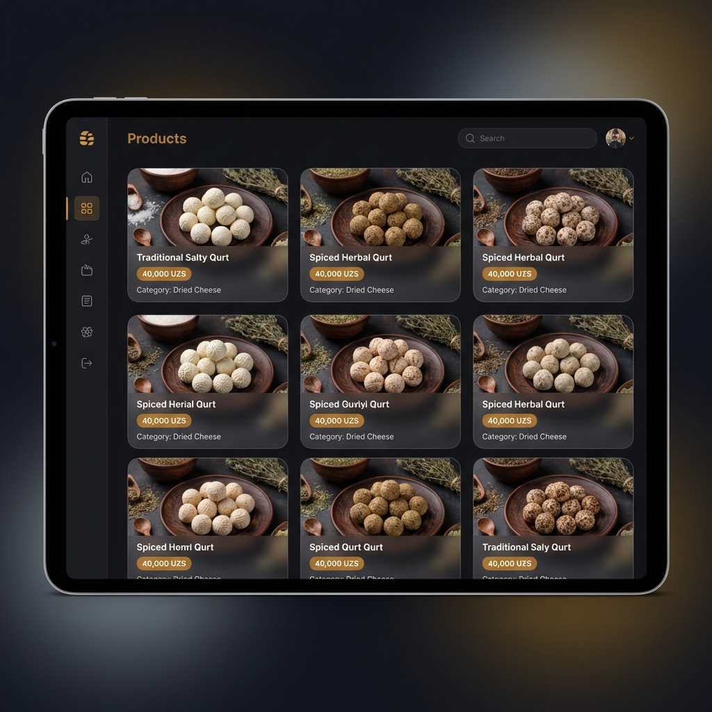
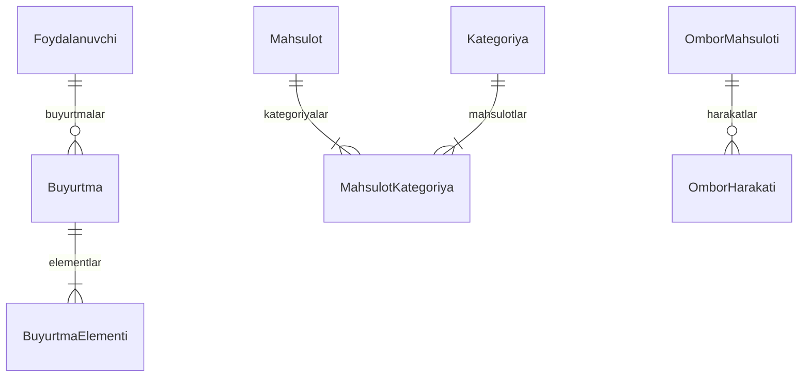

# NAVQURT - Loyiha Taqdimoti

**Qurt Savdosi Boshqaruv Paneli**

---

````carousel
## 🎯 Loyiha Haqida

**NAVQURT** - bu an'anaviy O'zbek qurti (quruq pishloq) ishlab chiqarish va sotish uchun mo'ljallangan zamonaviy boshqaruv paneli.

### Maqsad
- Buyurtmalarni samarali boshqarish
- Mahsulotlar katalogini yuritish
- Omborxonani nazorat qilish
- Mijozlar bazasini kuzatish

---

**Ishlab chiqilgan:** 2026-yil  
**Texnologiyalar:** Next.js, React, PostgreSQL
<!-- slide -->
## 🛠 Texnologiyalar


| Texnologiya | Versiya | Vazifasi |
|-------------|---------|----------|
| **Next.js** | 16.1.1 | Foydalanuvchi interfeysi + Server |
| **React** | 19.2.3 | UI kutubxonasi |
| **TypeScript** | 5.x | Kodni tiplash |
| **Prisma ORM** | 5.22.0 | Ma'lumotlar bazasi |
| **PostgreSQL** | - | Ma'lumotlar bazasi |
| **Tailwind CSS** | 4.x | Dizayn |
| **Cloudinary** | 2.8.0 | Rasmlarni saqlash |
<!-- slide -->
## 📊 Boshqaruv Paneli


### Asosiy Ko'rsatkichlar
- 📈 Sotuvlar statistikasi
- 💰 Daromad grafigi
- 👥 Yangi mijozlar
- 📦 Ombor holati
- 🛒 So'nggi buyurtmalar
<!-- slide -->
## 📦 Mahsulotlar



### Xususiyatlar
- ✅ Mahsulotlar katalogi
- ✅ Rasm yuklash (Cloudinary)
- ✅ Kategoriyalar boshqaruvi
- ✅ Ta'm variantlari (oddiy, achchiq, qalampirli)
- ✅ Narx va og'irlik sozlash
<!-- slide -->
## 🛒 Buyurtmalar


### Buyurtma Holatlari
| Holat | Rang | Tavsif |
|-------|------|--------|
| 🔵 Yangi | Ko'k | Yangi buyurtma |
| 🟢 Tasdiqlangan | Yashil | Qabul qilindi |
| 🟡 Tayyorlanmoqda | Sariq | Tayyorlanmoqda |
| 🟣 Yo'lda | Binafsha | Yetkazilmoqda |
| ⚪ Yetkazildi | Kulrang | Tugallandi |
| 🔴 Bekor | Qizil | Bekor qilindi |
<!-- slide -->
## 🏭 Omborxona


### Xususiyatlar
- 📥 Kirim/Chiqim boshqaruvi
- ⚠️ Kam qolgan mahsulotlar ogohlantirishi
- 📊 Harakatlar tarixi
- 💰 Narx hisobi
<!-- slide -->
## 🗄 Ma'lumotlar Bazasi



### 11 ta Jadval
- User, AdminUser
- Category, Product, ProductCategory, Variant
- Region, Order, OrderItem
- StockItem, StockMovement
<!-- slide -->
## 🔐 Xavfsizlik

### Autentifikatsiya
- ✅ NextAuth.js Credentials provayderi
- ✅ JWT Sessiya boshqaruvi
- ✅ Bcrypt parol xeshlash
- ✅ Himoyalangan API yo'nalishlari

### Administrator Kirish
```
Elektron pochta: admin@navqurt.uz
Parol: admin123
```

> ⚠️ Ishlab chiqarishda parolni o'zgartiring!
<!-- slide -->
## 🚀 Joylashtirish

### Hosting
- **Platforma:** Dokploy
- **Server:** 194.164.72.8
- **Domen:** navqurt.uz

### Xususiyatlar
- 🐳 Docker konteynerlashtirish
- 🔒 SSL/TLS (Let's Encrypt)
- 🔄 Avtomatik joylashtirish (GitHub webhook)
- 📊 Sog'liq monitoring
<!-- slide -->
## 📈 Natijalar

| Ko'rsatkich | Qiymat |
|-------------|--------|
| **Tugmalar** | 45 ta (96% ishlaydi) |
| **API Yo'nalishlari** | 18+ |
| **Sahifalar** | 7 ta |
| **Jadvallar** | 11 ta |
| **Build vaqti** | ~2 daqiqa |

### Audit Natijalari
- ✅ Barcha CRUD operatsiyalar ishlaydi
- ✅ Xatolik boshqaruvi mavjud
- ✅ Moslashuvchan dizayn
- ⚠️ 2 ta kichik muammo (bildirishnoma qo'ng'irog'i, nomlash)
<!-- slide -->
## 📞 Aloqa

### GitHub
[github.com/idrokaiassistant-wq/Navqurt](https://github.com/idrokaiassistant-wq/Navqurt)

### Domen
[navqurt.uz](https://navqurt.uz)

---

**E'tiboringiz uchun rahmat!** 🙏

*NAVQURT - An'anaviy ta'm, zamonaviy texnologiya*
````

---

## 📋 Slaydlar Ro'yxati

1. **Loyiha Haqida** - Maqsad va umumiy ma'lumot
2. **Texnologiyalar** - Texnologiyalar steki
3. **Boshqaruv Paneli** - Bosh sahifa
4. **Mahsulotlar** - Katalog
5. **Buyurtmalar** - Boshqaruv
6. **Omborxona** - Inventar
7. **Ma'lumotlar Bazasi** - ER diagramma
8. **Xavfsizlik** - Autentifikatsiya tizimi
9. **Joylashtirish** - Hosting
10. **Natijalar** - Statistika
11. **Aloqa** - Bog'lanish

---

*Taqdimot tayyorlandi: 2026-yil 9-yanvar*
