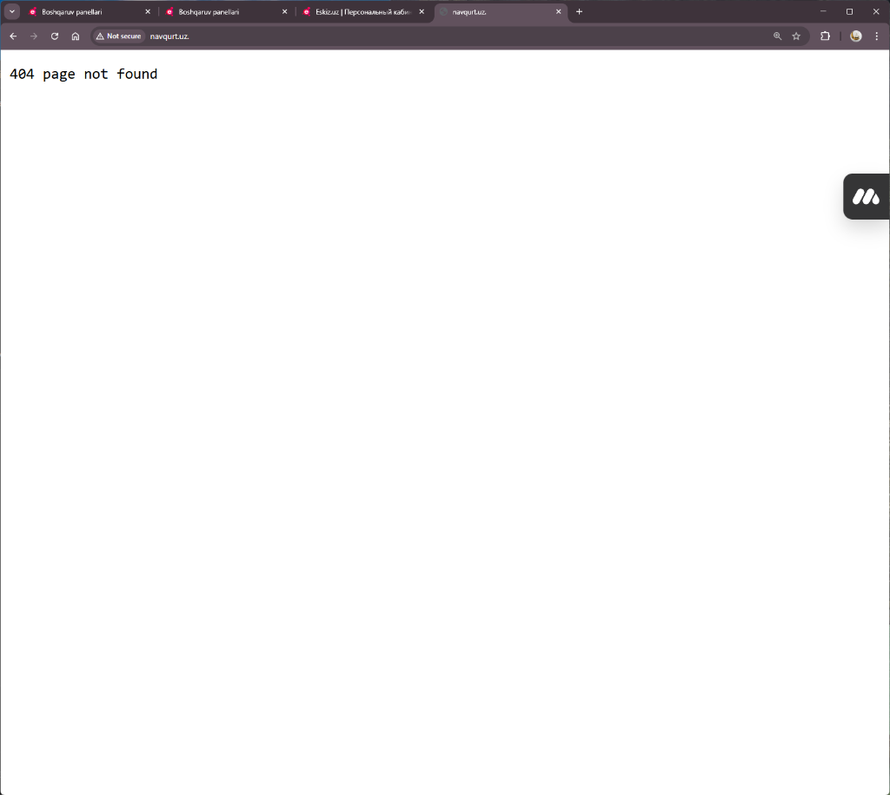
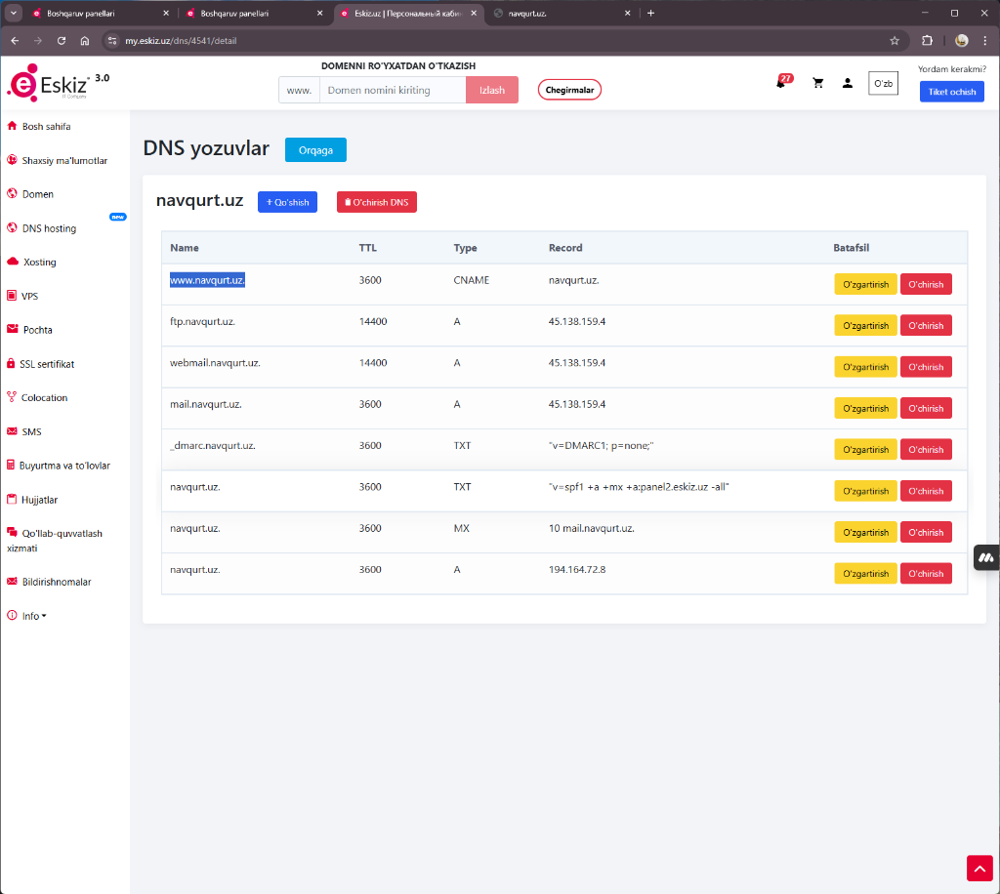
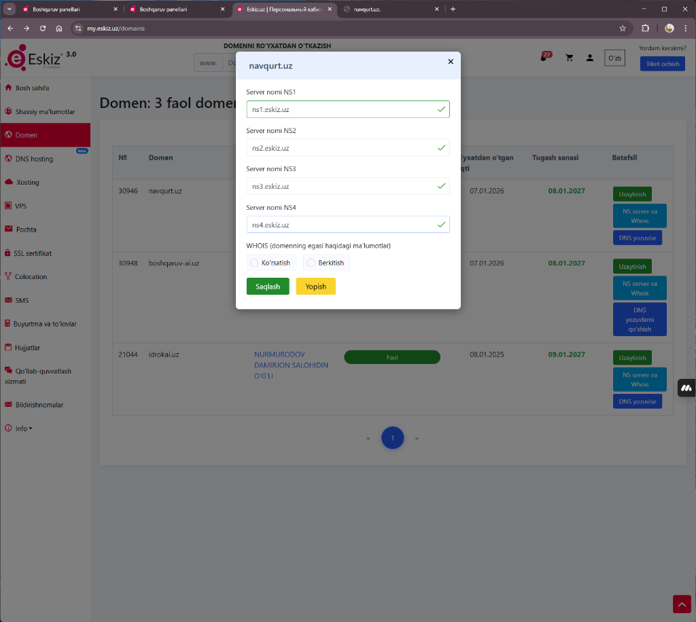
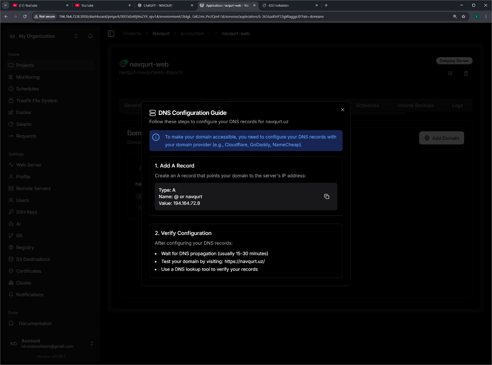
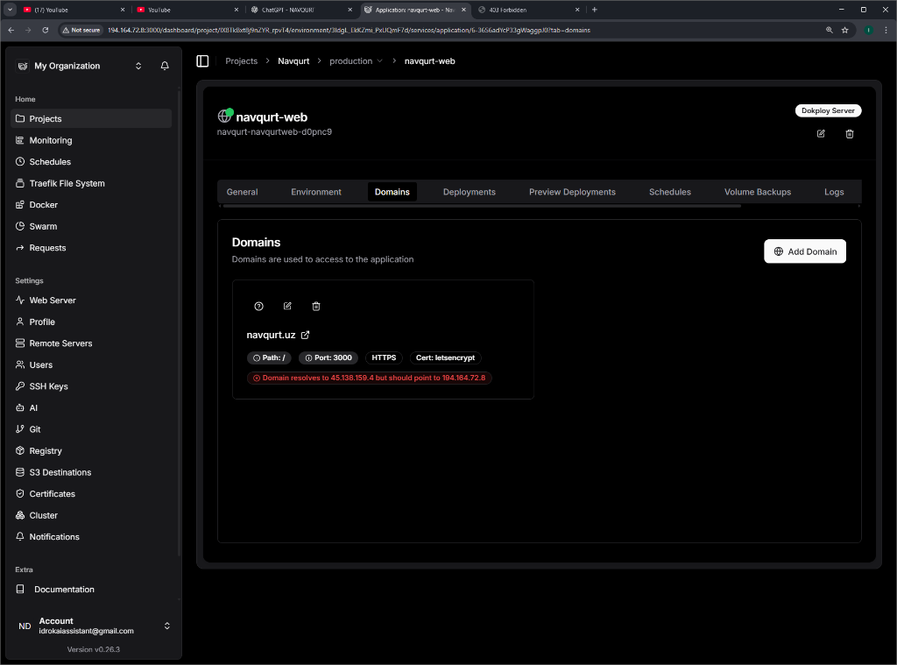

# Navqurt.uz Domen Konfiguratsiyasi Hisoboti

**Sana:** 2026-01-09  
**Loyiha:** Navqurt Web  
**Domen:** navqurt.uz

---

## 📋 Umumiy Holat

| Element | Holat |
|---------|-------|
| Build (Nixpacks) | ✅ Muvaffaqiyatli |
| Deploy (Dokploy) | ✅ Muvaffaqiyatli |
| Domen ulash | ❌ Xatolik mavjud |
| SSL (Let's Encrypt) | ⏳ Kutilmoqda |

---

## ✅ Bajarilgan Ishlar

### 1. Build Muvaffaqiyatli Yakunlandi
- Nixpacks v1.39.0 orqali build amalga oshirildi
- Node.js 20, NPM 9.x, OpenSSL o'rnatildi
- Next.js 16.1.1 (Turbopack) muvaffaqiyatli kompilatsiya qilindi
- 23 ta sahifa generatsiya qilindi
- Docker image yaratildi: `navqurt-navqurtweb-d0pnc9:latest`

### 2. DNS Yozuvlar Qo'shilgan (Eskiz panelida)
Quyidagi DNS yozuvlar mavjud:

| Name | TTL | Type | Record |
|------|-----|------|--------|
| www.navqurt.uz | 3600 | CNAME | navqurt.uz. |
| ftp.navqurt.uz | 14400 | A | 45.138.159.4 |
| webmail.navqurt.uz | 14400 | A | 45.138.159.4 |
| mail.navqurt.uz | 3600 | A | 45.138.159.4 |
| _dmarc.navqurt.uz | 3600 | TXT | "v=DMARC1; p=none;" |
| navqurt.uz | 3600 | TXT | "v=spf1 +a +mx +a:panel2.eskiz.uz ~all" |
| navqurt.uz | 3600 | MX | 10 mail.navqurt.uz. |
| **navqurt.uz** | **3600** | **A** | **194.164.72.8** |

### 3. NS Serverlar
Domen quyidagi NS serverlarga ulangan:
- ns1.eskiz.uz ✅
- ns2.eskiz.uz ✅
- ns3.eskiz.uz ✅
- ns4.eskiz.uz ✅

---

## ❌ Aniqlangan Xatoliklar

### 1. DNS A Record Noto'g'ri IP Manzilga Ishora Qilyapti

**Muammo:**
```
❌ Domain resolves to 45.138.159.4 but should point to 194.164.72.8
```

**Tushuntirish:**
- Dokploy server IP manzili: `194.164.72.8`
- Hozirgi DNS A record: `194.164.72.8` (to'g'ri qo'yilgan)
- Lekin brauzerda sayt `45.138.159.4` ga resolve bo'lyapti

**Sabab:**
DNS propagatsiya hali tugamagan yoki cache mavjud.

### 2. 404 Page Not Found

Saytga kirilganda `404 page not found` xatoligi chiqyapti.



---

## 🔧 Qilinishi Kerak Bo'lgan Ishlar

### 1. DNS Propagatsiyani Kutish
- DNS o'zgarishlar 15-30 daqiqa (ba'zan 24 soatgacha) vaqt olishi mumkin
- Tekshirish uchun: https://dnschecker.org/#A/navqurt.uz

### 2. Eskiz Panelida A Record Tekshirish
Eskiz panelida `navqurt.uz` uchun A record quyidagicha bo'lishi kerak:
```
Type: A
Name: @ (yoki navqurt.uz)
Value: 194.164.72.8
TTL: 3600
```

### 3. Eski A Recordni O'chirish
Agar `45.138.159.4` IP manziliga ishora qiluvchi eski A record mavjud bo'lsa, uni o'chirish kerak.

### 4. DNS Cache Tozalash
Lokal DNS cache tozalash:
```bash
# Windows
ipconfig /flushdns

# Mac
sudo dscacheutil -flushcache

# Linux
sudo systemd-resolve --flush-caches
```

### 5. SSL Sertifikat
DNS propagatsiya tugagandan so'ng SSL sertifikat avtomatik olinadi (Let's Encrypt).

---

## 📸 Rasmlar

### DNS Yozuvlar (Eskiz Panel)


### NS Serverlar


### Dokploy DNS Qo'llanma


### Dokploy Domain Xatoligi


### 404 Xatolik


---

## 📊 Keyingi Qadamlar

1. [ ] DNS propagatsiyani kutish (15-30 daqiqa)
2. [ ] https://navqurt.uz saytni tekshirish
3. [ ] SSL sertifikat olinganini tasdiqlash
4. [ ] Barcha sahifalar ishlayotganini tekshirish
5. [ ] Login funksiyasini tekshirish
6. [ ] Ma'lumotlar bazasi ulanishini tekshirish

---

## ⚠️ Muhim Eslatmalar

> **Diqqat!** Build logida quyidagi ogohlantirishlar mavjud:
> - `SecretsUsedInArgOrEnv: Do not use ARG or ENV instructions for sensitive data (ARG "NEXTAUTH_SECRET")`
> - `SecretsUsedInArgOrEnv: Do not use ARG or ENV instructions for sensitive data (ENV "NEXTAUTH_SECRET")`
> - `UndefinedVar: Usage of undefined variable '$NIXPACKS_PATH'`

Bu ogohlantirishlar xavfsizlik bilan bog'liq va kelajakda Docker Secrets yoki boshqa xavfsiz usul bilan almashtirilishi kerak.

---

*Hisobot yaratildi: 2026-01-09 00:37*
